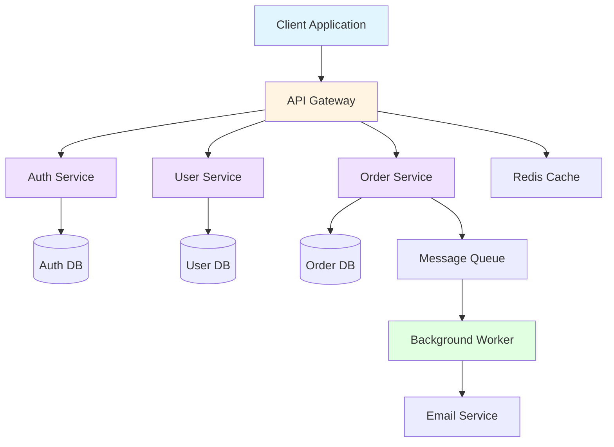
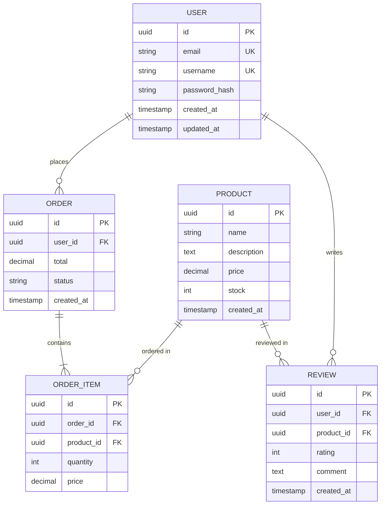
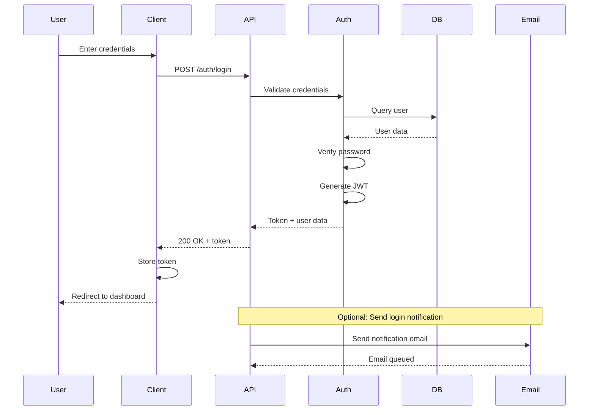

# Onboarding Documentation Generator

Generate comprehensive onboarding documentation for new engineers joining a project. This skill scans the codebase and produces four types of documentation:

1. **Architecture diagram** (system overview with mermaid)
2. **Data models** (ER diagrams with mermaid)
3. **API map** (endpoint inventory)
4. **Key flows** (user journeys and critical sequences)

## When to Use

Use this skill when:
- A new engineer is joining the team
- You need to document an existing codebase
- The project lacks architectural documentation
- Onboarding takes too long due to missing docs
- You're inheriting a project without documentation

DO NOT use this skill when:
- The codebase already has comprehensive documentation
- You only need API documentation (use dedicated API doc tools)
- You need runtime documentation (use profiling/tracing tools)

## Arguments

Codebase path (optional): `$ARGUMENTS`
- If provided, use it as the root directory to scan
- If not provided, use the current working directory

## Execution Steps

### Step 1: Understand the Codebase Structure

Use Glob to identify the project type and key files:

```bash
# Scan for common project files
Glob: "**/package.json"      # Node/TypeScript projects
Glob: "**/requirements.txt"  # Python projects
Glob: "**/Cargo.toml"        # Rust projects
Glob: "**/pom.xml"           # Java/Maven projects
Glob: "**/go.mod"            # Go projects
Glob: "**/*.csproj"          # C#/.NET projects
```

Identify the main entry points:
```bash
Glob: "**/main.py"
Glob: "**/app.py"
Glob: "**/server.ts"
Glob: "**/index.ts"
Glob: "**/main.go"
Glob: "**/Program.cs"
```

### Step 2: Scan for Architecture Components

Use Glob to find architectural layers:

**Backend/Services:**
```bash
Glob: "**/services/**/*.{ts,js,py,go,cs}"
Glob: "**/controllers/**/*.{ts,js,py,go,cs}"
Glob: "**/handlers/**/*.{ts,js,py,go,cs}"
Glob: "**/routes/**/*.{ts,js,py,go,cs}"
Glob: "**/middleware/**/*.{ts,js,py,go,cs}"
```

**Database/Data Layer:**
```bash
Glob: "**/models/**/*.{ts,js,py,go,cs}"
Glob: "**/schema/**/*.{ts,js,sql,prisma}"
Glob: "**/migrations/**/*.{sql,ts,js,py}"
Glob: "**/repositories/**/*.{ts,js,py,go,cs}"
```

**Frontend (if applicable):**
```bash
Glob: "**/components/**/*.{tsx,jsx,vue,svelte}"
Glob: "**/pages/**/*.{tsx,jsx,vue,svelte}"
Glob: "**/views/**/*.{tsx,jsx,vue,svelte}"
```

**Configuration:**
```bash
Glob: "**/config/**/*.{ts,js,py,yaml,yml,json}"
Glob: "**/.env.example"
Glob: "**/docker-compose.yml"
```

### Step 3: Extract Data Models

Use Grep to find data model definitions:

**Python (SQLAlchemy, Django, Pydantic):**
```bash
Grep: "class.*\(.*Model.*\):" --type py
Grep: "class.*\(.*BaseModel.*\):" --type py
Grep: "db\.Model" --type py
```

**TypeScript/JavaScript (Prisma, TypeORM, Mongoose):**
```bash
Grep: "model\s+\w+" --type prisma
Grep: "@Entity\(\)" --type ts
Grep: "new Schema\(" --type js
Grep: "interface\s+\w+.*\{" --type ts -A 10
```

**Go (GORM, structs):**
```bash
Grep: "type\s+\w+\s+struct\s*\{" --type go -A 10
Grep: "gorm\.Model" --type go
```

**C# (Entity Framework):**
```bash
Grep: "public class.*\s*\{" --type cs -A 10
Grep: "\[Table\(" --type cs
```

Read the discovered model files to extract:
- Table/collection names
- Field names and types
- Relationships (foreign keys, references)
- Constraints and indexes

### Step 4: Map API Endpoints

Use Grep to find API route definitions:

**FastAPI (Python):**
```bash
Grep: "@app\.(get|post|put|delete|patch)" --type py -B 2
Grep: "@router\.(get|post|put|delete|patch)" --type py -B 2
```

**Express/NestJS (TypeScript/JavaScript):**
```bash
Grep: "app\.(get|post|put|delete|patch)" --type ts
Grep: "router\.(get|post|put|delete|patch)" --type ts
Grep: "@(Get|Post|Put|Delete|Patch)\(" --type ts -B 2
```

**Next.js API Routes:**
```bash
Glob: "**/app/api/**/*.{ts,js}"
Glob: "**/pages/api/**/*.{ts,js}"
```

**Go (Gin, Chi, Gorilla):**
```bash
Grep: "r\.(GET|POST|PUT|DELETE|PATCH)" --type go
Grep: "(Handle|HandleFunc)\(" --type go -B 2
```

**C# (ASP.NET):**
```bash
Grep: "\[Http(Get|Post|Put|Delete|Patch)\]" --type cs -B 2
Grep: "\[Route\(" --type cs
```

Read route files to extract:
- HTTP method
- Endpoint path
- Purpose/description from comments or function names
- Request/response types

### Step 5: Identify Key Flows

Use Grep to find important workflows:

**Authentication/Authorization:**
```bash
Grep: "(auth|login|signup|register)" -i
Grep: "(jwt|token|session)" -i
Grep: "(middleware|guard|protect)" -i
```

**Data Processing:**
```bash
Grep: "(process|pipeline|workflow|job|task)" -i
Grep: "(queue|worker|consumer)" -i
```

**Business Logic:**
```bash
Grep: "(order|payment|checkout|purchase)" -i
Grep: "(user|account|profile)" -i
Grep: "(create|update|delete).*service" -i
```

Read the identified files to understand:
- Entry points
- Sequence of operations
- Dependencies between components
- Error handling patterns

### Step 6: Generate Documentation Files

Create four documentation files in the `docs/` directory:

#### 6.1 Architecture Documentation

**File:** `docs/architecture.md`

Include:
- High-level system overview
- Technology stack
- Architectural layers (presentation, business logic, data)
- External dependencies (databases, APIs, services)
- Mermaid diagram showing component relationships

**Example Architecture Diagram:**
````markdown

````

**Template:**
```markdown
# Architecture Overview

## Purpose
[Brief description of what this system does]

## Technology Stack

### Backend
- Runtime: [e.g., Node.js, Python, Go]
- Framework: [e.g., Express, FastAPI, Gin]
- Database: [e.g., PostgreSQL, MongoDB]
- Cache: [e.g., Redis]

### Frontend (if applicable)
- Framework: [e.g., React, Vue, Angular]
- Build tool: [e.g., Vite, Webpack]

### Infrastructure
- Containerization: [e.g., Docker]
- Orchestration: [e.g., Kubernetes, Docker Compose]
- Cloud: [e.g., AWS, GCP, Azure]

## System Architecture

[Insert mermaid diagram here]

## Architectural Layers

### Presentation Layer
[Description of how clients interact with the system]

### Business Logic Layer
[Description of core services and their responsibilities]

### Data Layer
[Description of data storage and access patterns]

## External Dependencies
- [Service 1]: [Purpose]
- [Service 2]: [Purpose]

## Key Design Decisions
- [Decision 1]: [Rationale]
- [Decision 2]: [Rationale]
```

#### 6.2 Data Models Documentation

**File:** `docs/data-models.md`

Include:
- List of all data models/entities
- Mermaid ER diagram showing relationships
- Field descriptions for each model
- Indexes and constraints

**Example ER Diagram:**
````markdown

````

**Template:**
```markdown
# Data Models

## Overview
This document describes all data models used in the system.

## Entity Relationship Diagram

[Insert mermaid ER diagram here]

## Models

### [Model Name 1]

**Table/Collection:** `[table_name]`

**Description:** [Brief description of what this model represents]

**Fields:**
| Field | Type | Constraints | Description |
|-------|------|-------------|-------------|
| id | uuid | PK | Primary key |
| [field_name] | [type] | [constraints] | [description] |

**Relationships:**
- [Relationship description]

**Indexes:**
- [Index description]

---

### [Model Name 2]
[Repeat structure]
```

#### 6.3 API Map Documentation

**File:** `docs/api-map.md`

Include:
- All API endpoints organized by domain/resource
- HTTP method, path, and purpose
- Authentication requirements
- Request/response examples (if available in code)

**Template:**
```markdown
# API Endpoint Map

## Overview
Complete inventory of all API endpoints in the system.

## Authentication
[Description of authentication mechanism - JWT, session, API key, etc.]

## Endpoints

### User Management

#### Create User
- **Method:** `POST`
- **Path:** `/api/users`
- **Auth:** Public
- **Purpose:** Register a new user
- **Request Body:**
  ```json
  {
    "email": "string",
    "username": "string",
    "password": "string"
  }
  ```
- **Response:** `201 Created`

#### Get User
- **Method:** `GET`
- **Path:** `/api/users/:id`
- **Auth:** Required (Bearer token)
- **Purpose:** Retrieve user details
- **Response:** `200 OK`

---

### [Resource Category 2]
[Continue listing endpoints]

## Error Codes

| Code | Description |
|------|-------------|
| 400 | Bad Request - Invalid input |
| 401 | Unauthorized - Missing or invalid token |
| 403 | Forbidden - Insufficient permissions |
| 404 | Not Found - Resource does not exist |
| 500 | Internal Server Error |
```

#### 6.4 Key Flows Documentation

**File:** `docs/key-flows.md`

Include:
- Important user journeys
- Critical business processes
- Sequence diagrams for complex flows
- Error handling patterns

**Example Sequence Diagram:**
````markdown

````

**Template:**
```markdown
# Key Flows

## Overview
This document describes important workflows and user journeys in the system.

## Authentication Flow

### User Login

**Purpose:** Authenticate a user and issue an access token

**Steps:**
1. User submits credentials (email + password)
2. API validates input format
3. Auth service queries user from database
4. Auth service verifies password hash
5. Auth service generates JWT token
6. Token is returned to client
7. Client stores token for subsequent requests

**Sequence Diagram:**
[Insert mermaid sequence diagram here]

**Error Cases:**
- Invalid credentials → 401 Unauthorized
- Account locked → 403 Forbidden
- Server error → 500 Internal Server Error

---

## [Flow Name 2]
[Repeat structure for other flows]

## Common Patterns

### Error Handling
[Describe how errors are handled across the system]

### Data Validation
[Describe validation approach]

### Transaction Management
[Describe how transactions are handled]
```

### Step 7: Save Documentation

Use the Write tool to save all four files to the `docs/` directory:

1. Write `docs/architecture.md`
2. Write `docs/data-models.md`
3. Write `docs/api-map.md`
4. Write `docs/key-flows.md`

### Step 8: Generate Summary Report

After creating all documentation, provide a summary:

```markdown
# Onboarding Documentation Generated

Created comprehensive onboarding documentation in the `docs/` directory:

## Files Created
- `docs/architecture.md` - System architecture with [X] components
- `docs/data-models.md` - [Y] data models with relationships
- `docs/api-map.md` - [Z] API endpoints
- `docs/key-flows.md` - [N] key workflows documented

## Technology Stack Detected
- [List detected technologies]

## Next Steps for New Engineers
1. Read `docs/architecture.md` to understand the system structure
2. Review `docs/data-models.md` to understand data relationships
3. Reference `docs/api-map.md` when working with endpoints
4. Study `docs/key-flows.md` to understand critical workflows
5. Set up local development environment (see README.md)
6. Run tests to verify setup

## Documentation Maintenance
These docs should be updated when:
- New services/components are added
- Data models change
- New API endpoints are created
- Major workflows are modified
```

## Quality Guidelines

Good onboarding documentation:
- Is comprehensive but not overwhelming
- Uses visual diagrams for complex relationships
- Organizes information by concern (architecture, data, APIs, flows)
- Includes concrete examples
- Highlights critical paths and edge cases
- Is maintainable (can be easily updated)

Bad onboarding documentation:
- Dumps all code into one file
- Lacks structure or organization
- Misses critical components
- Uses vague descriptions
- Ignores relationships and dependencies
- Is hard to navigate

## Edge Cases

**Multi-service/microservice architecture:**
- Create separate sections for each service
- Document inter-service communication
- Include service dependency graph

**Monorepo with multiple applications:**
- Create docs/ in each app directory
- Add a root-level overview doc linking to each app

**No clear patterns detected:**
- Document what was found
- Note areas needing manual documentation
- Suggest next steps for completing documentation

## Validation

After generating documentation, verify:
- All mermaid diagrams render correctly
- File paths are accurate
- Code examples are valid
- Links between documents work
- No sensitive information is exposed (passwords, keys, etc.)

## Notes

- This skill GENERATES documentation, it does not modify code
- Always scan for secrets/credentials and exclude them
- Use relative paths in documentation for portability
- Prefer mermaid diagrams over static images (easier to update)
- Focus on what new engineers need, not exhaustive detail
- Update docs/ .gitignore if needed to track these files

---

## Sources (for research conducted)

Research on onboarding documentation practices and Claude Code skills informed this skill:
- [Extend Claude with skills - Claude Code Docs](https://code.claude.com/docs/en/skills)
- [GitHub - levnikolaevich/claude-code-skills](https://github.com/levnikolaevich/claude-code-skills)
- [10 Must-Have Skills for Claude in 2026 | Medium](https://medium.com/@unicodeveloper/10-must-have-skills-for-claude-and-any-coding-agent-in-2026-b5451b013051)
- [Automating docs with Claude Code | AI Bites 04](https://www.productver.se/p/automating-docs-with-claude-code)
- [Claude Code Skills: Complete Developer Guide (2026)](https://fp8.co/articles/Claude-Code-Skills-Complete-Developer-Guide)
